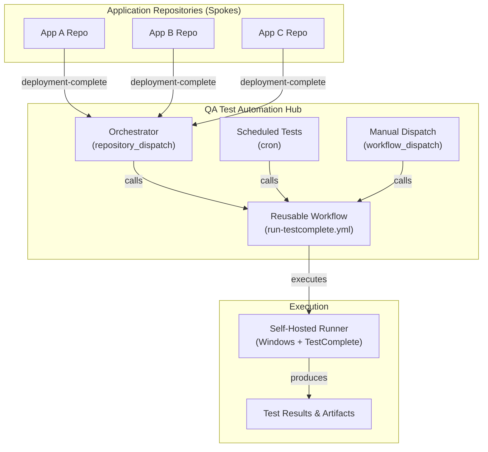

# QA Test Automation Hub

[](https://github.com/mobeus1/qa-test-automation/actions)
[](LICENSE)
[](https://smartbear.com/product/testcomplete/)

A centralized, scalable hub for orchestrating SmartBear TestComplete automated tests across multiple applications via GitHub Actions.

## Overview

The QA Test Automation Hub implements a **hub-and-spoke model** where:
- **Hub**: This central repository coordinates and executes tests
- **Spokes**: Individual application repositories trigger test execution after deployment

This architecture provides centralized test management, scalability, consistency, observability, and efficiency through scheduled regression testing and manual triggering.

## Architecture



## Quick Start

### Prerequisites
- Self-hosted GitHub Actions runner (Windows with TestComplete/TestExecute)
- TEST_EXECUTE_ACCESS_KEY secret configured
- Optional: NOTIFICATION_WEBHOOK secret for Slack notifications

### Manual Test Trigger
```bash
gh workflow run run-testcomplete.yml \
  -f app-name=app-a \
  -f environment=staging \
  -f test-suite=SmokeTests \
  --repo mobeus1/qa-test-automation
```

### Repository Dispatch (from App Repo)
```bash
gh api repos/mobeus1/qa-test-automation/dispatches \
  -f event_type=deployment-complete \
  -f 'client_payload[app_name]=your-app' \
  -f 'client_payload[environment]=staging' \
  -f 'client_payload[version]=v1.2.3'
```

## Repository Structure

```
qa-test-automation/
  .github/
    workflows/
      run-testcomplete.yml        # Reusable test execution workflow
      orchestrator.yml            # Handles repository dispatch events
      scheduled-regression.yml    # Scheduled test runs
      dispatch-example.yml        # Template for app repositories
    CODEOWNERS
  configs/
    app-a.json                    # App A test configuration
    app-b.json                    # App B test configuration
    shared-settings.json          # Shared TestComplete settings
  scripts/
    run-tests.bat                 # TestComplete CLI wrapper
    parse-results.py              # Test result parser
    notify.py                     # Notification handler
  docs/
    onboarding-new-app.md         # Step-by-step app onboarding
    architecture.md               # Architecture deep dive
    troubleshooting.md            # Common issues and solutions
  README.md
  CONTRIBUTING.md
  LICENSE
```

## How to Onboard a New Application

1. Create configs/your-app.json (see configs/app-a.json as template)
2. Add TestComplete project to test-suites/your-app/
3. Copy dispatch-example.yml to your app repo
4. Add to scheduled-regression.yml
5. Test with manual dispatch

See [Onboarding Guide](docs/onboarding-new-app.md) for details.

## Trigger Methods

| Method | Use Case | Trigger |
|--------|----------|---------|
| Repository Dispatch | After deployment | Automatic from app repo |
| Scheduled | Nightly regression | Cron (weekdays 2AM, Sat 4AM) |
| Manual | Ad-hoc testing | workflow_dispatch via UI or CLI |

## Configuration Reference

Each application needs a JSON config in configs/:

| Field | Required | Description |
|-------|----------|-------------|
| app_name | Yes | Unique application identifier |
| project_suite | Yes | Path to TestComplete project |
| test_items | Yes | Map of suite names to test arrays |
| environments | Yes | Per-env URLs and credentials |
| timeout_minutes | No | Max execution time (default: 30) |

## Documentation

- [Architecture Guide](docs/architecture.md)
- [Onboarding Guide](docs/onboarding-new-app.md)
- [Troubleshooting Guide](docs/troubleshooting.md)
- [Contributing](CONTRIBUTING.md)

## License

MIT License - see [LICENSE](LICENSE) for details.
