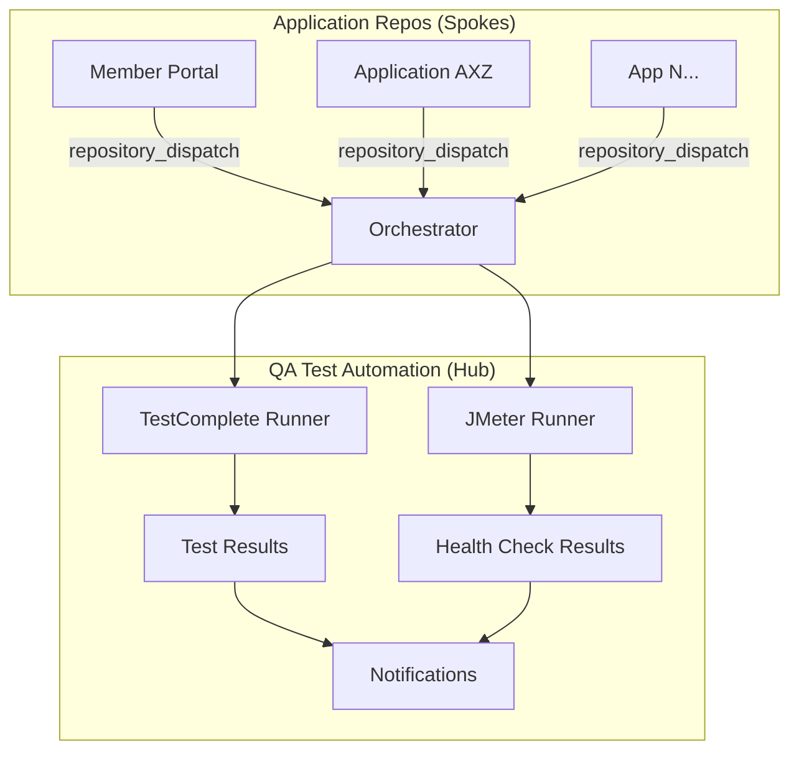

# QA Test Automation

Centralized test orchestration for running automated tests across multiple applications using GitHub Actions.

## Architecture

This repository uses a **hub-and-spoke model** where this central QA repo orchestrates test execution across all applications.



## Supported Test Types

| Tool | Purpose | Runner | Config Location |
|------|---------|--------|------------------|
| **TestComplete** | UI/Functional testing | Self-hosted Windows | `configs/apps/{app}/testcomplete.json` |
| **JMeter** | Health checks & load testing | Ubuntu (GitHub-hosted) | `configs/apps/{app}/jmeter.json` |

## Repository Structure

```
qa-test-automation/
├── .github/
│   ├── workflows/
│   │   ├── orchestrator.yml          # Main entry point (repository_dispatch)
│   │   ├── run-testcomplete.yml      # Reusable TestComplete workflow
│   │   ├── run-jmeter.yml            # Reusable JMeter workflow
│   │   ├── scheduled-regression.yml  # Cron-based regression runs
│   │   └── dispatch-example.yml      # Template for app repos
│   └── CODEOWNERS
├── configs/
│   ├── apps/
│   │   ├── member-portal/
│   │   │   ├── testcomplete.json
│   │   │   ├── jmeter.json
│   │   │   └── CODEOWNERS
│   │   └── application-axz/
│   │       ├── testcomplete.json
│   │       ├── jmeter.json
│   │       └── CODEOWNERS
│   └── shared-settings.json
├── scripts/
│   ├── run-tests.bat
│   ├── run-jmeter.sh
│   ├── parse-results.py
│   ├── parse-jmeter-results.py
│   └── notify.py
├── test-suites/
│   ├── member-portal/
│   │   ├── testcomplete/
│   │   └── jmeter/
│   └── application-axz/
│       ├── testcomplete/
│       └── jmeter/
├── docs/
│   ├── architecture.md
│   ├── onboarding-new-app.md
│   └── troubleshooting.md
├── CONTRIBUTING.md
├── LICENSE
└── README.md
```

## Quick Start

### 1. Trigger Tests After Deployment

Add the dispatch workflow to your app repo (see `dispatch-example.yml`):

```yaml
- name: Dispatch to QA Repo
  uses: peter-evans/repository-dispatch@v3
  with:
    token: ${{ secrets.QA_DISPATCH_PAT }}
    repository: your-org/qa-test-automation
    event-type: deployment-complete
    client-payload: |
      {
        "app_name": "your-app-name",
        "environment": "staging",
        "test_suite": "SmokeTests",
        "test_type": "all"
      }
```

### 2. Onboard a New Application

1. Create `configs/apps/{app-name}/testcomplete.json`
2. Create `configs/apps/{app-name}/jmeter.json`
3. Create `configs/apps/{app-name}/CODEOWNERS`
4. Add test suites under `test-suites/{app-name}/`
5. Add the dispatch trigger to your app repo

See [Onboarding Guide](docs/onboarding-new-app.md) for details.

### 3. Run Tests Manually

Go to **Actions > Scheduled Regression Tests > Run workflow** and select your app, environment, and test type.

## Trigger Methods

| Method | When | How |
|--------|------|-----|
| **Post-Deploy** | After successful deployment | `repository_dispatch` from app repo |
| **Scheduled** | Weeknights 2AM, Saturdays 4AM UTC | Cron in `scheduled-regression.yml` |
| **Manual** | On demand | `workflow_dispatch` in GitHub UI |

## Configuration Reference

### TestComplete Config

| Field | Description |
|-------|-------------|
| `app_name` | Unique application identifier |
| `project_suite` | Path to .pjs TestComplete project |
| `test_items` | Named test suites with test item lists |
| `environments` | Per-env base URLs and credential secrets |
| `timeout_minutes` | Max execution time |

### JMeter Config

| Field | Description |
|-------|-------------|
| `app_name` | Unique application identifier |
| `test_plans` | Named plans (health-check, smoke, load, stress) |
| `health_endpoints` | API endpoints to verify |
| `environments` | Per-env base URLs and overrides |
| `thresholds` | Pass/fail criteria (response time, error rate) |

## Scaling to 50+ Applications?

⚠️ **Important**: The current monorepo structure works well for 10-20 apps but doesn't scale beyond that.

If you're managing **50+ applications** (especially 100+), consider migrating to a **multi-repo architecture**:

- 📖 **[Scalable Architecture Options](docs/scalable-architecture-options.md)** - Detailed comparison of approaches
- 🚀 **[Migration Summary](docs/MIGRATION-SUMMARY.md)** - Quick start guide
- 🛠️ **[Multi-Repo Setup Guide](docs/multi-repo-setup-guide.md)** - Team setup instructions
- 🤖 **[Automated Migration Script](scripts/migrate-to-multi-repo.py)** - One-command migration

**Benefits of multi-repo**: 10x faster CI/CD, better team autonomy, repo-level access control, scales to 1000+ apps.

## Documentation

- [Architecture Deep Dive](docs/architecture.md)
- [Non-Technical Overview](docs/non-technical-overview.md)
- [Onboarding New Applications](docs/onboarding-new-app.md)
- [Troubleshooting Guide](docs/troubleshooting.md)
- [Scalable Architecture Options](docs/scalable-architecture-options.md) ⭐ **For 50+ apps**
- [Migration Summary](docs/MIGRATION-SUMMARY.md)
- [Multi-Repo Setup Guide](docs/multi-repo-setup-guide.md)

## Required Secrets

| Secret | Purpose |
|--------|--------|
| `QA_DISPATCH_PAT` | PAT with repo scope for cross-repo dispatch |
| `TEST_EXECUTE_ACCESS_KEY` | SmartBear TestExecute license key |
| `NOTIFICATION_WEBHOOK` | Slack/Teams webhook URL |
| `{APP}_STAGING_CREDS` | Per-app staging credentials |
| `{APP}_PROD_CREDS` | Per-app production credentials |
