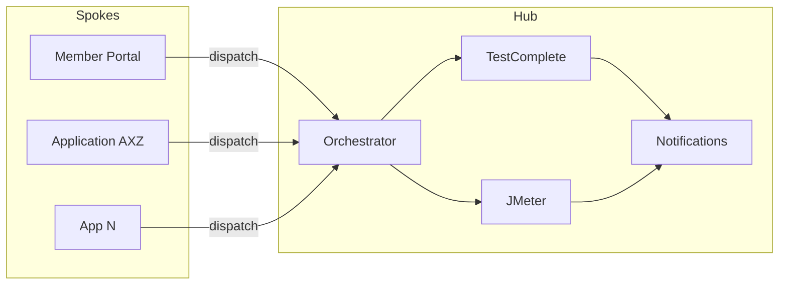
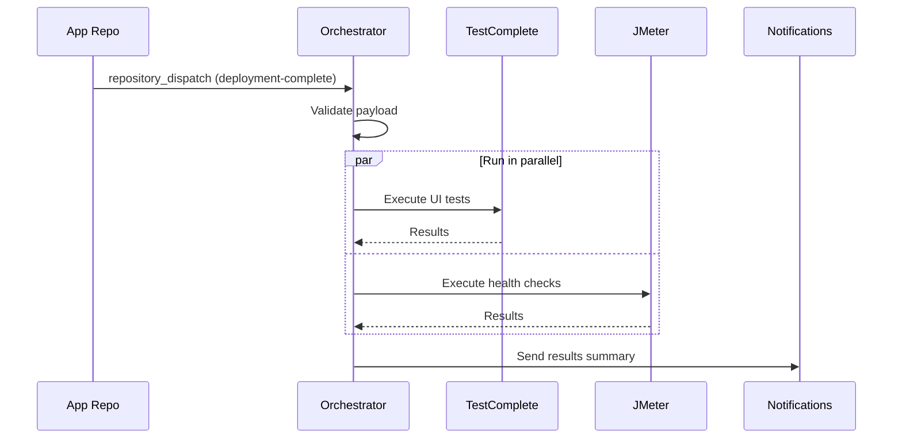

# Architecture Deep Dive

## Hub-and-Spoke Model

This QA automation system uses a centralized hub-and-spoke architecture:

- **Hub**: This repository (`qa-test-automation`) contains all test orchestration logic, configurations, and reusable workflows
- **Spokes**: Individual application repositories trigger tests via `repository_dispatch` events after deployment



## Why Hub-and-Spoke?

| Approach | Pros | Cons |
|----------|------|------|
| **Hub-and-Spoke (chosen)** | Single source of truth, easy onboarding, consistent execution | Requires cross-repo PAT, central point of coordination |
| Single Pipeline per Repo | Simple, self-contained | Duplicated logic, inconsistent configs, hard to maintain |
| Monorepo | Everything together | Doesn't match multi-app reality |

## Workflow Architecture

### Entry Points

Three ways tests get triggered:

1. **repository_dispatch** - `orchestrator.yml` receives events from app repos after deployment
2. **schedule** - `scheduled-regression.yml` runs on cron (weeknights + weekends)
3. **workflow_dispatch** - Manual trigger from GitHub Actions UI

### Reusable Workflows

#### TestComplete (`run-testcomplete.yml`)

Runs SmartBear TestComplete/TestExecute UI tests on self-hosted Windows runners.

- Loads config from `configs/apps/{app-name}/testcomplete.json`
- Executes test suites via `scripts/run-tests.bat`
- Parses results with `scripts/parse-results.py`
- Uploads artifacts (logs, screenshots)
- Sends failure notifications

#### JMeter (`run-jmeter.yml`)

Runs Apache JMeter health checks and load tests on GitHub-hosted Ubuntu runners.

- Loads config from `configs/apps/{app-name}/jmeter.json`
- Supports multiple test plans: health-check, smoke, load, stress
- Either uses existing .jmx files or auto-generates from health endpoints
- Validates against thresholds (response time, error rate, percentiles)
- Generates HTML reports and markdown summaries

### Orchestrator Flow



## Configuration Architecture

### Per-Application Config Structure

Each application has its own folder under `configs/apps/`:

```
configs/apps/{app-name}/
├── testcomplete.json    # TestComplete test configuration
├── jmeter.json          # JMeter health check configuration
└── CODEOWNERS           # Team ownership for this app's configs
```

This structure allows:
- **Independent ownership**: Each team owns their app's config via CODEOWNERS
- **Tool-specific configs**: Separate files per test tool
- **Easy onboarding**: Copy a template folder and customize
- **Extensibility**: Add new tool configs (e.g., `playwright.json`) without changing existing ones

### Config Resolution Order

1. Per-app tool config (`configs/apps/{app}/testcomplete.json`)
2. Shared settings (`configs/shared-settings.json`)
3. Workflow defaults (hardcoded in YAML)

## Security Model

- **Cross-repo dispatch**: Requires a PAT (`QA_DISPATCH_PAT`) with `repo` scope
- **Credentials**: Stored as GitHub Secrets, referenced by name in app configs
- **Log masking**: All credentials automatically masked in workflow logs
- **CODEOWNERS**: Enforces review requirements per application

## Extensibility

### Adding a New Test Tool

1. Create a new reusable workflow: `.github/workflows/run-{tool}.yml`
2. Add a script wrapper: `scripts/run-{tool}.sh`
3. Add a results parser: `scripts/parse-{tool}-results.py`
4. Add tool defaults to `configs/shared-settings.json`
5. Create per-app config: `configs/apps/{app}/{tool}.json`
6. Wire it into `orchestrator.yml` and `scheduled-regression.yml`
