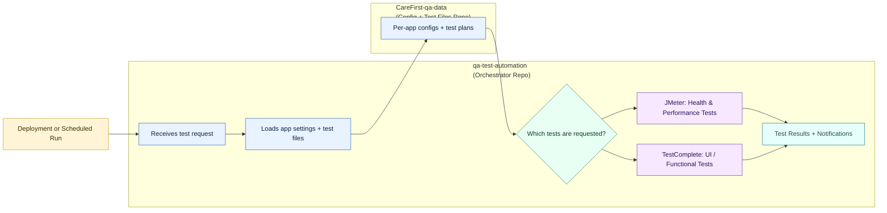

# Non-Technical Overview: How QA Testing Works

This guide explains how our QA testing system works in plain language. It also shows how to onboard a new application for **JMeter** (performance/health checks) and **TestComplete** (UI/functional tests).

## Simple Explanation

We use two GitHub repositories that work together:

1. **Test Orchestrator (this repo)**
   - Think of this as the "control center".
   - It receives a signal when your app deploys or when tests are scheduled.
   - It decides which tests to run and then runs them.

2. **CareFirst-qa-data (data repo)**
   - Think of this as the "library".
   - It stores the test settings and test files for each application.
   - It does not run anything. It just provides the data.

## Visual Workflow (Mermaid)



## How This Works in Practice

- Your app deploys or someone manually starts a test.
- The **Test Orchestrator** pulls the correct files from **CareFirst-qa-data**.
- It runs the tests and saves results.
- If something fails, it sends a notification.

You only edit the **CareFirst-qa-data** repo for new apps or changes. The orchestrator stays stable.

---

# Onboarding a New Application

## A) JMeter (Performance + Health Checks)

**Goal:** Add health checks and performance tests for your app.

### Step 1: Create the folder

```
CareFirst-qa-data/apps/<your-app-name>/
```

### Step 2: Add JMeter config

Create:

```
CareFirst-qa-data/apps/<your-app-name>/jmeter.json
```

This file tells the system:
- Where your app is (staging/prod URL)
- Which health endpoints to check
- Performance thresholds

### Step 3: Add JMeter test files (for performance tests)

Create:

```
CareFirst-qa-data/apps/<your-app-name>/jmeter/
```

Add these files if you want performance testing:

```
health-check.jmx
smoke.jmx
load.jmx
stress.jmx
```

Notes:
- **Health checks** can be auto-generated from the config if `health-check.jmx` is missing.
- **Smoke/load/stress** require the matching `.jmx` file.

### Step 4: Test it

Trigger a test run after deployment, or manually run a JMeter test using the orchestrator.

---

## B) TestComplete (UI / Functional Tests)

**Goal:** Run UI automation for your app.

### Step 1: Create the folder

```
CareFirst-qa-data/apps/<your-app-name>/
```

### Step 2: Add TestComplete config

Create:

```
CareFirst-qa-data/apps/<your-app-name>/testcomplete.json
```

This file tells the system:
- Which test suite to run
- URLs and credentials for staging/prod
- Which test cases belong in each suite (SmokeTests, RegressionTests, etc.)

### Step 3: Add the TestComplete project

Create:

```
CareFirst-qa-data/apps/<your-app-name>/testcomplete/
```

Put your `.pjs` and related files here.

### Step 4: Test it

Trigger a TestComplete run after deployment or on schedule.

---

## Example Folder Layout

```
CareFirst-qa-data/
└── apps/
    └── member-portal/
        ├── jmeter.json
        ├── jmeter/
        │   ├── health-check.jmx
        │   ├── smoke.jmx
        │   ├── load.jmx
        │   └── stress.jmx
        ├── testcomplete.json
        └── testcomplete/
            └── MemberPortal.pjs
```

---

## Why This Split Helps

- **Cleaner repo**: Orchestrator stays small and stable
- **Faster updates**: Teams update only their app data
- **Scales easily**: Works for 150+ apps
- **Clear ownership**: Each team owns their app folder

---

## Who to Contact

If you need help onboarding a new app or updating test files, contact the QA team.
