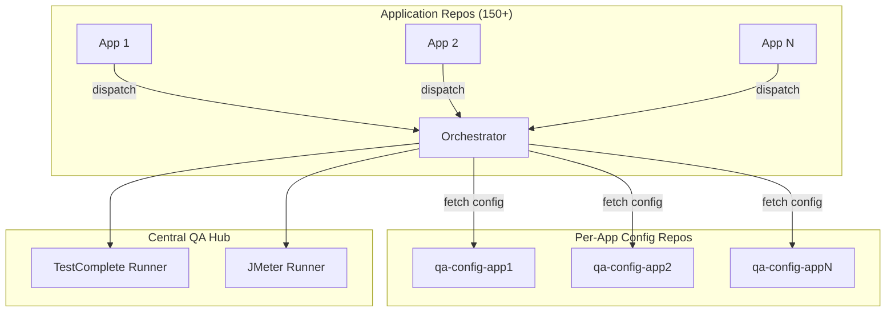
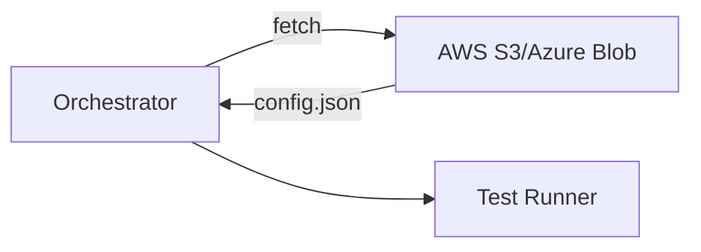

# Scalable Architecture Options for 150+ Applications

## Problem Statement

The current monorepo approach doesn't scale well beyond 10-20 applications. With 150+ applications, you'll face:

- **Clone bloat**: 150 apps × ~50MB average = 7.5GB+ repository
- **Slow CI/CD**: Every workflow clones the entire repo
- **Access control**: Can't easily restrict teams to only their app configs
- **Deployment complexity**: Single change requires full repo checkout

---

## ✅ Recommended: Multi-Repo with Centralized Orchestration

### Architecture Overview



### Structure

#### 1. Central Orchestration Repo (`qa-test-automation`)
**Purpose**: Reusable workflows, scripts, and orchestration logic only

```
qa-test-automation/
├── .github/workflows/
│   ├── orchestrator.yml              # Dynamic config fetcher
│   ├── run-testcomplete.yml          # Reusable test runners
│   ├── run-jmeter.yml
│   └── scheduled-regression.yml
├── scripts/
│   ├── fetch-config.sh               # Downloads app config from external repo
│   ├── run-tests.bat
│   ├── run-jmeter.sh
│   └── notify.py
├── docs/
└── README.md
```

**Size**: ~10MB (no test suites or configs)

#### 2. Per-Application Config Repos (`qa-config-{app-name}`)
**Purpose**: Isolated configuration and test suites per application

```
qa-config-member-portal/
├── config.json                       # Combined testcomplete + jmeter config
├── testcomplete/
│   └── MemberPortal.pjs              # TestComplete project
├── jmeter/
│   ├── health-check.jmx
│   └── load-test.jmx
├── CODEOWNERS
└── README.md
```

**Each repo**: 5-100MB depending on test suite size
**Total org repos**: 1 orchestrator + 150 config repos = 151 repos

#### 3. Application Repos (Unchanged)
Continue dispatching events to the central hub as before.

---

### Workflow Flow

#### Orchestrator Workflow (`orchestrator.yml`)

```yaml
name: QA Orchestrator
on:
  repository_dispatch:
    types: [deployment-complete]

jobs:
  orchestrate:
    runs-on: ubuntu-latest
    steps:
      - name: Checkout orchestrator
        uses: actions/checkout@v4
      
      - name: Fetch app configuration
        run: |
          APP_NAME="${{ github.event.client_payload.app_name }}"
          
          # Clone specific app config repo
          gh repo clone your-org/qa-config-${APP_NAME} app-config -- --depth=1
        env:
          GH_TOKEN: ${{ secrets.CONFIG_READ_PAT }}
      
      - name: Parse config and set outputs
        id: config
        run: |
          CONFIG=$(cat app-config/config.json)
          echo "test_suite_path=$(pwd)/app-config" >> $GITHUB_OUTPUT
          echo "config=${CONFIG}" >> $GITHUB_OUTPUT
      
      - name: Run TestComplete
        if: github.event.client_payload.test_type == 'all' || ...
        uses: ./.github/workflows/run-testcomplete.yml
        with:
          config: ${{ steps.config.outputs.config }}
          test_suite_path: ${{ steps.config.outputs.test_suite_path }}
      
      - name: Run JMeter
        if: github.event.client_payload.test_type == 'all' || ...
        uses: ./.github/workflows/run-jmeter.yml
        with:
          config: ${{ steps.config.outputs.config }}
          test_suite_path: ${{ steps.config.outputs.test_suite_path }}
```

#### Dynamic Config Fetching Script (`scripts/fetch-config.sh`)

```bash
#!/bin/bash
# Fetches only the required app config repo

APP_NAME=$1
CONFIG_CACHE_DIR="${RUNNER_TEMP}/qa-configs"

mkdir -p "${CONFIG_CACHE_DIR}"

# Check if already cached (for scheduled runs with multiple apps)
if [ -d "${CONFIG_CACHE_DIR}/${APP_NAME}" ]; then
  echo "Using cached config for ${APP_NAME}"
  exit 0
fi

# Clone with depth=1 for minimal data transfer
gh repo clone "your-org/qa-config-${APP_NAME}" \
  "${CONFIG_CACHE_DIR}/${APP_NAME}" \
  -- --depth=1 --single-branch

echo "CONFIG_PATH=${CONFIG_CACHE_DIR}/${APP_NAME}" >> $GITHUB_OUTPUT
```

---

### Benefits

| Aspect | Monorepo | Multi-Repo |
|--------|----------|------------|
| **Clone time** | 7.5GB, 5+ minutes | 10MB hub + 50MB config = 60MB, <30s |
| **CI/CD speed** | Slow (full checkout) | Fast (minimal checkout) |
| **Parallel updates** | Merge conflicts | Independent updates |
| **Access control** | Complex CODEOWNERS | Repo-level permissions |
| **Storage** | 7.5GB single repo | 151 small repos |
| **Team autonomy** | Blocked by central PRs | Self-service config updates |
| **Versioning** | Single version | Per-app versioning |
| **Discoverability** | Good (single place) | Requires naming convention |

---

### Migration Path

#### Phase 1: Create Template Config Repo
```bash
# Create template
gh repo create your-org/qa-config-template --template --public

# Template structure
mkdir -p qa-config-template/{testcomplete,jmeter}
cat > qa-config-template/config.json <<EOF
{
  "app_name": "{{APP_NAME}}",
  "testcomplete": { ... },
  "jmeter": { ... }
}
EOF
```

#### Phase 2: Automated Repo Generation
```python
# scripts/migrate-to-multi-repo.py
import os
import json
import subprocess

def create_config_repo(app_name, source_config_dir):
    repo_name = f"qa-config-{app_name}"
    
    # Create repo from template
    subprocess.run([
        "gh", "repo", "create", f"your-org/{repo_name}",
        "--template", "your-org/qa-config-template",
        "--private"
    ])
    
    # Clone, populate, and push
    subprocess.run(["gh", "repo", "clone", f"your-org/{repo_name}"])
    
    # Copy existing configs
    subprocess.run(["cp", "-r", f"{source_config_dir}/testcomplete", f"{repo_name}/"])
    subprocess.run(["cp", "-r", f"{source_config_dir}/jmeter", f"{repo_name}/"])
    subprocess.run(["cp", source_config_dir + "/CODEOWNERS", f"{repo_name}/"])
    
    # Merge configs into single file
    with open(f"{source_config_dir}/testcomplete.json") as tc:
        tc_config = json.load(tc)
    with open(f"{source_config_dir}/jmeter.json") as jm:
        jm_config = json.load(jm)
    
    combined = {
        "app_name": app_name,
        "testcomplete": tc_config,
        "jmeter": jm_config
    }
    
    with open(f"{repo_name}/config.json", "w") as f:
        json.dump(combined, f, indent=2)
    
    # Commit and push
    os.chdir(repo_name)
    subprocess.run(["git", "add", "."])
    subprocess.run(["git", "commit", "-m", f"Initial config for {app_name}"])
    subprocess.run(["git", "push"])
    os.chdir("..")

# Migrate all apps
apps_dir = "configs/apps"
for app_name in os.listdir(apps_dir):
    print(f"Migrating {app_name}...")
    create_config_repo(app_name, os.path.join(apps_dir, app_name))
```

#### Phase 3: Update Orchestrator
- Modify `orchestrator.yml` to fetch configs dynamically
- Update reusable workflows to accept config as parameter
- Update scripts to work with dynamic paths

#### Phase 4: Deprecate Monorepo Configs
- Archive `configs/` and `test-suites/` directories
- Update documentation
- Notify teams to use new config repos

---

## Alternative: Hybrid Approach

Keep **only configs** in monorepo, but **test suites** in separate repos.

```
qa-test-automation/                   (configs only, ~5MB)
├── configs/apps/{150 apps}           (JSON files only)

qa-test-suites-member-portal/         (separate repos)
├── testcomplete/
└── jmeter/
```

**When to use**: If test suites are large (>50MB each) but configs are small (<1KB).

**Fetching logic**:
```yaml
- name: Fetch test suite
  run: |
    SUITE_REPO="qa-test-suites-${{ github.event.client_payload.app_name }}"
    gh repo clone your-org/${SUITE_REPO} test-suite -- --depth=1
```

---

## Alternative: Config File Storage Service

For maximum scalability, store configs in external storage rather than Git repos.



### Implementation

```yaml
- name: Fetch config from S3
  run: |
    APP_NAME="${{ github.event.client_payload.app_name }}"
    aws s3 cp s3://qa-configs/${APP_NAME}/config.json config.json
    aws s3 sync s3://qa-test-suites/${APP_NAME}/ test-suite/ --size-only
```

**Benefits**:
- No repo scaling issues
- Fast downloads (CDN-backed)
- Version control via S3 versioning
- Easy backup/restore

**Drawbacks**:
- Requires cloud storage setup
- Less intuitive than Git
- Separate access control system
- No native code review flow

---

## ✅ Final Recommendation

**Use Multi-Repo Approach**

**Why**: Best balance of:
- ✅ Scalability (handles 1000+ apps easily)
- ✅ Performance (minimal clone times)
- ✅ Team autonomy (independent updates)
- ✅ Access control (repo-level permissions)
- ✅ Familiar tooling (Git-based)
- ✅ Version history per app

**Implementation checklist**:
1. Create `qa-config-template` repository
2. Run migration script to generate 150 config repos
3. Update orchestrator to fetch configs dynamically
4. Test with 2-3 pilot applications
5. Roll out to remaining apps
6. Archive monorepo configs

**ROI**: 
- Setup time: 1-2 weeks
- Maintenance reduction: 50%+ (fewer conflicts, faster CI)
- CI/CD speed improvement: 10x faster (60MB vs 7.5GB)

---

## Appendix: Repo Naming Convention

Standard naming for discoverability:

```
qa-test-automation               # Central orchestrator
qa-config-member-portal         # App config repos
qa-config-application-axz
qa-config-customer-dashboard
...
```

Use GitHub Topics for organization:
- `qa-automation`
- `qa-config`
- `test-configuration`
